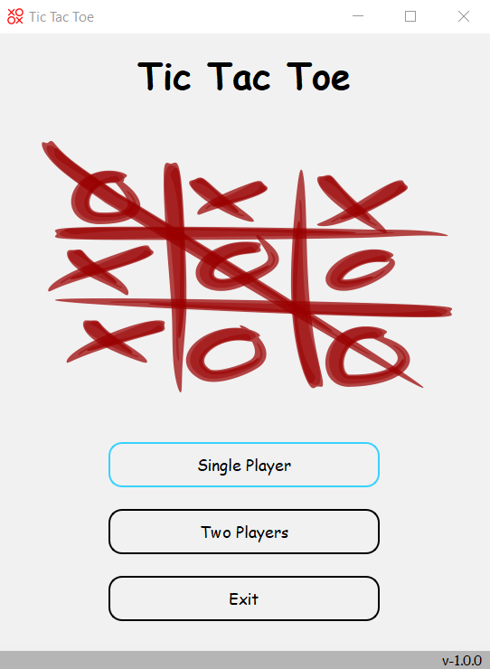
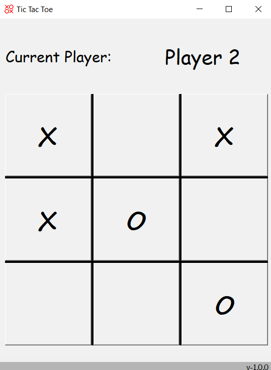
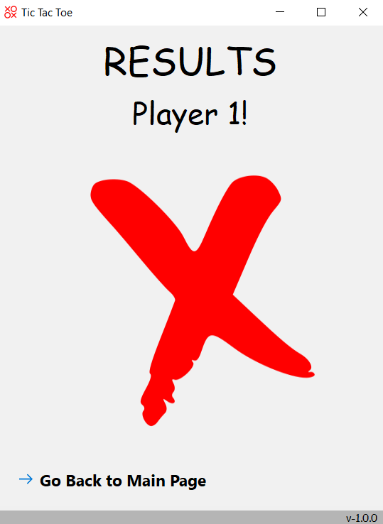
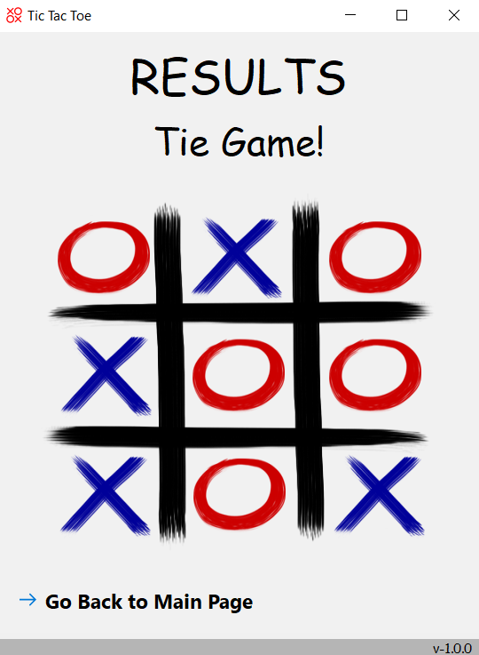
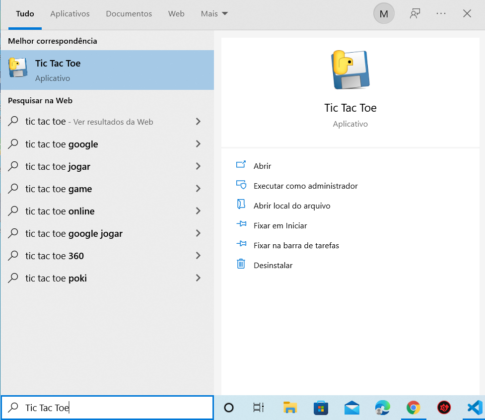

# TicTacToe

  
Um jogo de video game do clássico Jogo da Velha para desktop.

 

## Indice
[Sobre](#sobre) &#8226; [Features](#features) &#8226; [Tecnologias e Ferramentas usadas](#tecnologias-e-ferramentas-usadas) &#8226; [Versão](#vers%C3%A3o) &#8226; [Pré-requisitos](#pr%C3%A9-requisitos) &#8226; [Instruções de uso](#instru%C3%A7%C3%B5es-de-uso)

## Sobre
 O jogo conta com dois modos, dois jogadores, *TwoPlayer*, ou jogador contra máquina, *Single Player*.

## Recursos
- [x] Modo de jogo Single Player.
- [x] Modo de jogo Two Player.
- [x] Resultado do jogo de forma personalizada.
- [x] Instalador do jogo.

  
 
 
## Tecnologias
* Python 3.10
* PyQt5
* PyInstaller

## Uso
* Baixe o instalador e prossiga até a confirmação da instalação, por fim acesse atráves da barra de pesquisa.

## Acesso ao código
* Clone este repositório.   
` git clone https://github.com/caio-bernardo/TicTacToe.git`
> Você também pode fazer isso pelo GitHub Desktop ou baixar os arquivos manualmente.
* Baixe as dependências do projeto.  
`$ pip install -r requirements`

> Para executar o projeto
* Execute o arquivo run.py.  
`$ python run.py`
* Ou importe a função `start`
~~~ 
from game import start
start()
~~~
